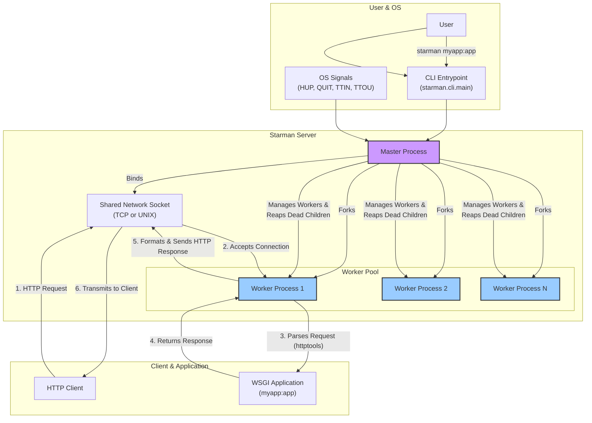

Based on the provided files, it's clear this is a Python port of the original Perl Starman server. The codebase itself seems to be missing the core Python source files (`.py`), but the `pyproject.toml`, `README.md`, and `CHANGELOG.md` provide definitive clues about its structure and design. The architecture described below is inferred from these packaging and documentation files, using the original Perl version's design and common patterns for Python-based preforking WSGI servers as a model.

## Architectural Overview

Starman is a high-performance, preforking WSGI (Web Server Gateway Interface) web server designed for UNIX-like operating systems. Its architecture is centered around a classic **preforking model**, where a master process manages a pool of worker processes. This design aims to provide high concurrency and robustness while maintaining a small memory footprint, especially when preloading an application.

### Core Design Principles

*   **High Performance**: Leverages the fast `httptools` library, a Python binding for the Node.js HTTP parser, to minimize the overhead of parsing incoming HTTP requests.
*   **Preforking Model**: A single master process binds to the network socket(s) and forks a configurable number of child worker processes *before* accepting any connections. This reduces the latency of handling a new request, as a worker is always ready.
*   **Process Management & Signal Handling**: The master process is responsible for managing the lifecycle of the worker pool. It handles OS signals to allow for graceful restarts (`HUP`), graceful shutdowns (`QUIT`), and dynamic scaling of the worker pool (`TTIN`/`TTOU`).
*   **WSGI Compatibility**: It is designed to run any standard WSGI-compliant Python web application or framework.
*   **Memory Efficiency**: By preloading the application in the master process before forking (`--preload-app`), workers can share the application's memory pages through the kernel's copy-on-write (CoW) mechanism, significantly reducing overall memory consumption.

### Architecture Diagram

### Core Components

The codebase can be logically divided into the following components:

1.  **CLI Entrypoint (`starman.cli`)**
    *   **Purpose**: To parse command-line arguments and initiate the server.
    *   **Implementation**: As defined in `pyproject.toml` (`[project.scripts]`), the `starman` command executes the `main` function in the `starman.cli` module. This module uses Python's `argparse` (or a similar library) to handle options like `--workers`, `--listen`, and `--preload-app`. It is responsible for loading the WSGI application object and passing the configuration to the Master Process.

2.  **Master Process (`starman.server.Master`)**
    *   **Purpose**: The central coordinator and process manager. It does not handle requests itself.
    *   **Responsibilities**:
        *   **Socket Binding**: Opens one or more TCP or UNIX domain sockets based on the `--listen` arguments and listens for incoming connections.
        *   **Worker Management**: Forks an initial pool of worker processes. It maintains the desired number of workers, replacing any that die unexpectedly.
        *   **Signal Handling**: Sets up handlers for OS signals:
            *   `HUP`: Instructs all workers to finish their current request and then exit gracefully. The master then forks new workers to replace them, allowing for code reloads.
            *   `QUIT`: Instructs workers to shut down gracefully and then exits itself.
            *   `TTIN`/`TTOU`: Increases or decreases the number of active worker processes.
        *   **Application Preloading**: If `--preload-app` is used, the master imports and loads the WSGI application *before* forking.

3.  **Worker Process (`starman.server.Worker`)**
    *   **Purpose**: To accept connections and process HTTP requests. Each worker is a separate OS process.
    *   **Responsibilities**:
        *   **Accept Loop**: Enters a loop to `accept()` new connections from the shared socket descriptor inherited from the master. The OS kernel distributes incoming connections among the waiting workers.
        *   **Request Handling**: For each connection:
            1.  Reads raw HTTP data from the socket.
            2.  Feeds the data into the `httptools` parser.
            3.  Using callbacks from the parser, it constructs the WSGI `environ` dictionary.
            4.  It defines the `start_response` callable, as required by the WSGI spec.
            5.  It invokes the user's WSGI application: `app(environ, start_response)`.
            6.  It takes the status, headers, and body returned by the application.
            7.  It formats this into a valid HTTP response and writes it back to the socket.
        *   **Keep-Alive**: Manages HTTP keep-alive by waiting for another request on the same connection if the client supports it, before looping back to `accept()`.

4.  **HTTP Parsing (`httptools` Integration)**
    *   **Purpose**: Fast and efficient HTTP request parsing.
    *   **Implementation**: Instead of a pure-Python parser, Starman relies on `httptools`. The Worker component would implement a protocol class with methods like `on_url`, `on_header`, `on_body`, and `on_message_complete`. The `httptools.HttpRequestParser` is fed the raw socket data, and it calls these methods as it parses the stream, allowing the worker to build the `environ` dictionary efficiently.

### Request Lifecycle

1.  The **Master** process starts, binds to a socket (e.g., `0.0.0.0:8080`), and forks a pool of **Worker** processes.
2.  Each **Worker** process enters a loop, blocking on an `accept()` call on the shared socket.
3.  A **Client** sends an HTTP request to `0.0.0.0:8080`. The OS kernel wakes up one of the idle **Workers** and gives it the connection.
4.  The selected **Worker** reads the request from the socket.
5.  The raw request data is fed to the **`httptools` parser**.
6.  The parser invokes callbacks within the worker, which populates the WSGI `environ` dictionary. The request body is read into a temporary buffer or file-like object and assigned to `environ['wsgi.input']`.
7.  The **Worker** calls the user's **WSGI Application** with the `environ` dictionary.
8.  The **WSGI Application** processes the request and returns the status, headers, and response body.
9.  The **Worker** formats the data into an HTTP response string.
10. The **Worker** writes the response back to the client socket and closes it (or keeps it alive for the next request).
11. The **Worker** goes back to step 2, waiting for the next connection.
